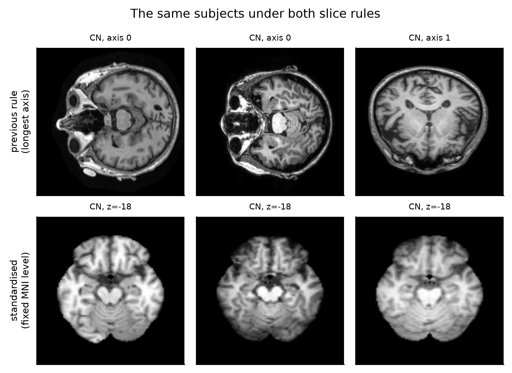
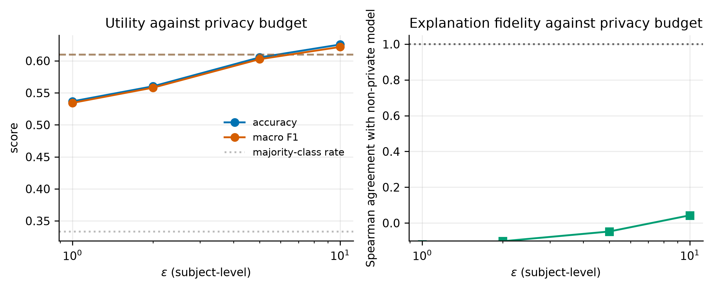

# Privacy-Preserving and Explainable Federated Learning for Alzheimer's Detection

CN / MCI / AD classification from ADNI brain MRI, trained without pooling data
across sites, and evaluated so that no subject — and, in the stricter protocol,
no *site* — appears in more than one split.

**[Live demo and results dashboard](https://vaibhav2824.github.io/privacy-federated-alzheimer-detection/)**
· [Paper (PDF)](paper.pdf) · [What was rebuilt and why](RESEARCH_PLAN_V3.md)

---

## Two measurement defects, both corrected

**The first was leakage.** An earlier version reported 97.0% federated
accuracy. That came from splitting individual MRI *slices* rather than
*subjects*, so scans of the same patient appeared in both training and test
data. Rebuilt on subject-disjoint folds, the number fell to 36.1% against a
33.3% chance rate.

**The second was the slice rule itself**, and it is why the corrected number
sat at chance. `preprocess.py` chose its slice axis as the longest array axis:

```python
axial_axis = np.argmax(data.shape)   # the defect
```

Over this cohort that extracts a different anatomical plane per subject:

| stored shape | header orientation | axis chosen | plane actually extracted |
| --- | --- | --- | --- |
| (256, 240, 160) | RAS | 0 | **sagittal** |
| (256, 256, 166) | IPL | 0 | **axial** |
| (166, 256, 256) | RAS | 1 | **coronal** |

It raises no error. It produces chance accuracy, which the previous version
attributed to cohort size and to the difficulty of MCI. Three further problems
compounded it: no spatial normalisation, no skull stripping, and a file glob
that counted five ADNI preprocessing levels of one acquisition as five samples.

Orientation could not simply be read back from the files either: **272 of the
620 usable scans carry a degenerate identity affine** (`sform_code = 2`,
`qform_code = 0`), for which `nibabel` reports RAS and leaves a sagittally
acquired array untouched.



## Recovering orientation by measurement

Each of the 48 axis permutations and reflections is registered to a 4 mm
**whole-head** ICBM152 target and scored. The target has to keep its skull: the
scan being oriented has not been stripped yet, and matching an unstripped head
against a skull-stripped brain scored 0.09–0.48 and selected a *different,
wrong* orientation on the same subjects, where head-to-head scores 0.68–0.79
with a clear step down to the third candidate. That also fixes the pipeline
order — deepbet leaves face and neck behind when handed a scan lying on its
side, so orientation has to come first.

The fit is per (series family, array shape) group, since the convention belongs
to the DICOM-to-NIfTI conversion. One convention covers the whole raw-series
family:

| series group | scans | permutation | flips | handedness evidence |
| --- | --- | --- | --- | --- |
| MPRAGE 256×240×160 | 107 | (2,1,0) | (T,T,T) | four anchor subjects |
| MPRAGE 256×256×170 | 69 | (2,1,0) | (T,T,T) | determinant consistency |
| IR-SPGR 256×256×196 | 51 | (2,1,0) | (T,T,T) | determinant consistency |
| MPRAGE 256×240×176 | 38 | (2,1,0) | (T,T,T) | determinant consistency |
| MPRAGE 170×256×256 | 6 | (0,2,1) | (T,T,T) | determinant already agreed |
| MPRAGE 256×256×160 | 1 | (1,0,2) | (T,T,T) | determinant already agreed |

Registration cannot separate an orientation from its left–right mirror — the
two stay within about 0.01. Four subjects hold both a degenerate scan and one
with a usable header; registering a subject's two scans against each other uses
that subject's own asymmetry, and the fitted orientation beats its mirror on
all four (**0.87–0.93 against 0.61–0.70**).

**297 of 298 subjects pass registration QC** (correlation with the MNI152
template inside the brain mask; median 0.529, threshold 0.30). The one failure
is excluded by that recorded rule.

## What this project reports

297 subjects (101 CN, 98 MCI, 98 AD) across 42 ADNI sites, 140 region features,
out-of-fold over five folds and three seeds.

| Task | Split | Accuracy | Macro F1 | Macro AUROC | Chance |
| --- | --- | --- | --- | --- | --- |
| CN vs AD | subject-disjoint | **79.7%** | 0.797 | 0.865 | 50.8% |
| CN vs AD | site-disjoint | 78.2% | 0.782 | 0.856 | 50.8% |
| MCI vs AD | subject-disjoint | **65.0%** | 0.650 | 0.732 | 50.0% |
| CN vs MCI | subject-disjoint | **62.3%** | 0.622 | 0.647 | 50.8% |
| CN / MCI / AD | subject-disjoint | **51.1%** | 0.508 | 0.702 | 34.0% |
| CN / MCI / AD | site-disjoint | 48.7% | 0.482 | 0.687 | 34.0% |

Against what the previous version reported on the same cohort and the same
subject-disjoint protocol:

| | before | after | change |
| --- | --- | --- | --- |
| CN / MCI / AD accuracy | 36.1% | **51.1%** | **+15.0 pts** |
| CN / MCI / AD macro F1 | 0.354 | **0.508** | **+0.154** |
| CN / MCI / AD macro AUROC | 0.579 | **0.702** | **+0.123** |

No extra data and no larger model — the model got *smaller*, from 23.5M CNN
parameters to 140 anatomical features. The difficulty ordering across the four
contrasts is the clinically expected one, which is itself evidence the pipeline
is measuring anatomy rather than acquisition.

## Federation over the real ADNI sites

The natural partition puts one client per real site, pooling sites below eight
subjects so that none is discarded. The heterogeneity is the cohort's own:
site 003 contributes 11 CN and 5 AD subjects but **no MCI**, site 016
contributes 5 MCI and 8 AD but **no CN**.

| Partition | Clients | Client sizes | Label entropy | CN/MCI/AD | CN vs AD |
| --- | --- | --- | --- | --- | --- |
| IID | 8 | 29–30 | 1.078 | 48.1% | 76.2% |
| Dirichlet α = 0.5 | 8 | 1–61 | 0.726 | 48.1% | 74.9% |
| **Real ADNI sites** | 10 | **8–119** | 0.941 | **46.9%** | **74.7%** |

Federating costs 3–5 points. The real partition is at least as hard as the
Dirichlet draw *despite carrying higher label entropy*, which says the standard
simulated benchmark does not capture what makes multi-site federation
difficult — extreme client-size imbalance and genuine scanner variation sit on
top of label skew.

A **site-disjoint** evaluation is reported next to the subject-disjoint one,
since a federated model is deployed at hospitals that did not contribute to it.
It costs only 1.5–2.8 points across all four contrasts.

## Subject-level differential privacy is a dimension problem

The Gaussian noise added to a summed update is isotropic in `d`, so its
expected norm is `σC√d` while the update itself does not grow with `d`. The
usable regime is therefore fixed by the perturbed dimension:

| model | d | noise/signal at ε=1 | at ε=2 | at ε=5 | at ε=10 |
| --- | --- | --- | --- | --- | --- |
| MNI region model | 423 | **0.98** | **0.55** | **0.26** | **0.16** |
| ResNet50 head | 6,147 | 3.75 | 2.10 | 1.01 | 0.60 |
| ResNet50, full | 23,508,035 | 232.0 | 129.7 | 62.3 | 37.4 |

Below 1.0 the update survives the noise. Utility follows:

| Task | ε | σ | Accuracy | Macro F1 | Attack AUROC |
| --- | --- | --- | --- | --- | --- |
| CN vs AD | non-private | — | 76.0% | 0.760 | — |
| CN vs AD | 10 | 1.83 | **76.0%** | 0.759 | — |
| CN vs AD | 5 | 3.04 | 74.6% | 0.745 | — |
| CN vs AD | 2 | 6.34 | 69.4% | 0.692 | — |
| CN vs AD | 1 | 11.34 | **67.4%** | 0.673 | — |
| CN/MCI/AD | non-private | — | 45.9% | 0.459 | 0.688 |
| CN/MCI/AD | 10 | 1.83 | 49.0% | 0.484 | 0.606 |
| CN/MCI/AD | 5 | 3.04 | 46.3% | 0.460 | 0.587 |
| CN/MCI/AD | 2 | 6.34 | 42.5% | 0.424 | 0.559 |
| CN/MCI/AD | 1 | 11.34 | 39.8% | 0.396 | **0.544** |

Subject-level DP stays usable down to ε = 1, where the previous version
reported the same mechanism collapsing onto the majority class at 23.5M
parameters. A subject-level membership inference attack falls from 0.688 to
0.544 against a chance rate of 0.500, so the formal budget and the empirical
attack move together.

## Explanations degrade faster than accuracy

Because every feature is a named Harvard-Oxford region on the MNI grid, an
attribution is a value per region and two models' attributions are directly
comparable — which slice-space heat maps are not, since pixel (i, j) refers to
different anatomy in different subjects.

| ε | CN vs AD accuracy | Region-attribution agreement | Medial-temporal share |
| --- | --- | --- | --- |
| non-private | 76.0% | **0.976** | 10.4% |
| 10 | **76.0%** | **0.062** | 5.8% |
| 5 | 74.6% | −0.034 | 5.3% |
| 2 | 69.4% | −0.101 | 5.1% |
| 1 | 67.4% | −0.123 | 5.0% |

At ε = 10 the private model's accuracy is *identical* to the non-private
model's, while the Spearman agreement of its region attribution has collapsed
from 0.976 to 0.062 and its attribution in hippocampus and amygdala has halved.
Seed-to-seed variation alone gives 0.94–0.98, so the drop is far outside noise.
Accuracy-only privacy–utility curves miss this entirely.



## Repository layout

```
paper.tex, paper.pdf     the write-up; every numeric table is generated
RESEARCH_PLAN_V3.md      what was wrong, what was rebuilt, and why
figures/v3/              figures for the rebuilt pipeline
ui/                      in-browser demo and results dashboard
ppxfl-alzheimer/
  src/preprocess_v3.py     scan selection, orientation, stripping, registration
  src/orientation*.py      the 48-candidate orientation search
  src/handedness.py        left/right resolution against anchor subjects
  src/features.py          tissue segmentation and atlas region morphometry
  src/slices_v3.py         2.5D slices at named MNI coordinates
  src/deep_features.py     frozen-backbone embeddings (head dimension 6,147)
  src/splits_v3.py         subject and site folds; natural/IID/Dirichlet clients
  src/federated_v3.py      FedAvg with subject-level DP and RDP accounting
  src/xai_v3.py            region attribution and its stability under privacy
  src/mia_v3.py            subject-level membership inference
  results_v3/              the rebuilt cohort's runs
  results_v2/              the slice-space runs, kept for the audit trail
  results/                 the earlier 32-subject cohort, kept for the audit
```

## Reproducing

ADNI scans are not redistributed; access requires a
[data use agreement](https://adni.loni.usc.edu/data-samples/access-data/).

```bash
pip install -e "ppxfl-alzheimer[dev]"
```

```bash
cd ppxfl-alzheimer && python -m src.fit_orientation --data-root ..
```

```bash
cd ppxfl-alzheimer && python run_v3.py
```

Stages are individually skippable, since registration and slice extraction are
cached on disk:

```bash
python run_v3.py --stages features centralised federated privacy aggregate figures
```

Tests, lint and the coverage gate:

```bash
pytest --cov --cov-config=.coveragerc
```

## Disclaimer

Research code. Not a medical device, not validated for clinical use, and not to
be used to inform care for any person.

## License

MIT. See [LICENSE](LICENSE).
