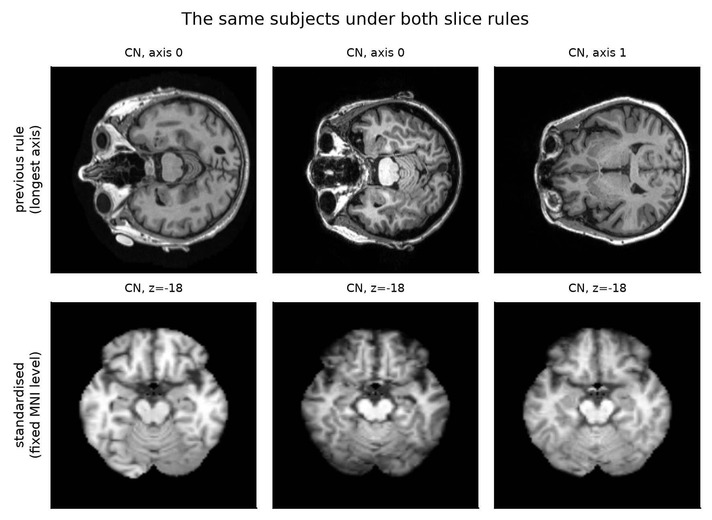
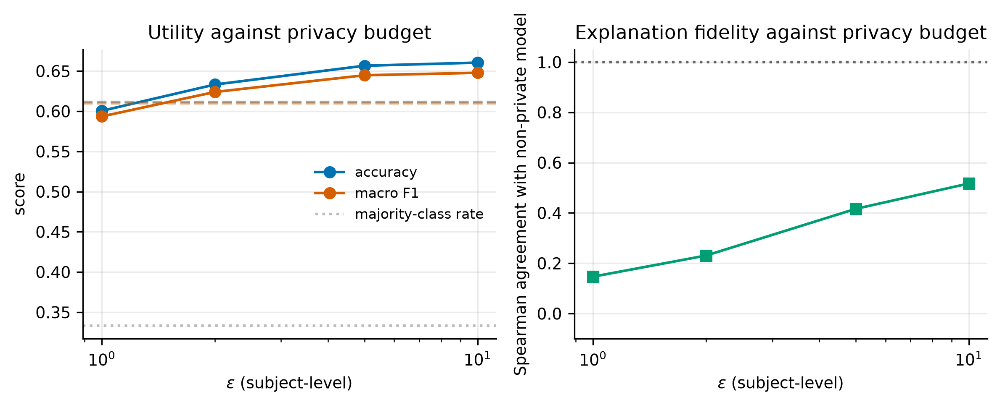

# Privacy-Preserving and Explainable Federated Learning for Alzheimer's Detection

CN / MCI / AD classification from ADNI brain MRI, trained without pooling data
across sites, and evaluated so that no subject — and, in the stricter protocol,
no *site* — appears in more than one split.

**[Live demo and results dashboard](https://vaibhav2824.github.io/privacy-federated-alzheimer-detection/)**
· [Paper (PDF)](paper.pdf) · [What was rebuilt and why](RESEARCH_PLAN_V3.md)

---

## Two measurement defects, both corrected

**The first was leakage.** An earlier version reported 97.0% federated
accuracy. That came from splitting individual MRI *slices* rather than
*subjects*, so scans of the same patient appeared in both training and test
data. Rebuilt on subject-disjoint folds, the number fell to 36.1% against a
33.3% chance rate.

**The second was the slice rule itself**, and it is why the corrected number
sat at chance. `preprocess.py` chose its slice axis as the longest array axis:

```python
axial_axis = np.argmax(data.shape)   # the defect
```

Over this cohort that extracts a different anatomical plane per subject:

| stored shape | header orientation | axis chosen | plane actually extracted |
| --- | --- | --- | --- |
| (256, 240, 160) | RAS | 0 | **sagittal** |
| (256, 256, 166) | IPL | 0 | **axial** |
| (166, 256, 256) | RAS | 1 | **coronal** |

It raises no error. It produces chance accuracy, which the previous version
attributed to cohort size and to the difficulty of MCI. Three further problems
compounded it: no spatial normalisation, no skull stripping, and a file glob
that counted five ADNI preprocessing levels of one acquisition as five samples.

Orientation could not simply be read back from the files either: **267 of the
761 registered scans carry a degenerate identity affine** (`sform_code = 2`,
`qform_code = 0`), for which `nibabel` reports RAS and leaves a sagittally
acquired array untouched.



## Recovering orientation by measurement

Each of the 48 axis permutations and reflections is registered to a 4 mm
**whole-head** ICBM152 target and scored. The target has to keep its skull: the
scan being oriented has not been stripped yet, and matching an unstripped head
against a skull-stripped brain scored 0.09–0.48 and selected a *different,
wrong* orientation on the same subjects, where head-to-head scores 0.68–0.79
with a clear step down to the third candidate. That also fixes the pipeline
order — deepbet leaves face and neck behind when handed a scan lying on its
side, so orientation has to come first.

The fit is per (series family, array shape) group, since the convention belongs
to the DICOM-to-NIfTI conversion. One convention covers the whole raw-series
family:

| series group | scans | permutation | flips | handedness evidence |
| --- | --- | --- | --- | --- |
| MPRAGE 256×240×160 | 107 | (2,1,0) | (T,T,T) | four anchor subjects |
| MPRAGE 256×256×170 | 69 | (2,1,0) | (T,T,T) | determinant consistency |
| IR-SPGR 256×256×196 | 51 | (2,1,0) | (T,T,T) | determinant consistency |
| MPRAGE 256×240×176 | 38 | (2,1,0) | (T,T,T) | determinant consistency |
| MPRAGE 170×256×256 | 6 | (0,2,1) | (T,T,T) | determinant already agreed |
| MPRAGE 256×256×160 | 1 | (1,0,2) | (T,T,T) | determinant already agreed |

Registration cannot separate an orientation from its left–right mirror — the
two stay within about 0.01. Four subjects hold both a degenerate scan and one
with a usable header; registering a subject's two scans against each other uses
that subject's own asymmetry, and the fitted orientation beats its mirror on
all four (**0.87–0.93 against 0.61–0.70**).

**760 of 761 subjects pass registration QC** (correlation with the MNI152
template inside the brain mask, threshold 0.30). The one failure is excluded by
that recorded rule.

## What this project reports

760 subjects (266 CN, 255 MCI, 239 AD) across 65 ADNI sites, 140 region
features, out-of-fold over five folds and three seeds. 760 of 761 registered
scans pass QC (correlation with the MNI152 template inside the brain mask,
threshold 0.30); the one failure is excluded by that recorded rule.

| Task | Split | Accuracy | Macro F1 | Macro AUROC | Chance |
| --- | --- | --- | --- | --- | --- |
| CN vs AD | subject-disjoint | **78.9%** | 0.787 | 0.862 | 52.7% |
| CN vs AD | site-disjoint | 77.4% | 0.773 | 0.853 | 52.7% |
| MCI vs AD | subject-disjoint | **65.5%** | 0.655 | 0.703 | 51.6% |
| MCI vs AD | site-disjoint | 65.0% | 0.650 | 0.699 | 51.6% |
| CN vs MCI | subject-disjoint | **64.6%** | 0.644 | 0.662 | 51.1% |
| CN vs MCI | site-disjoint | 63.1% | 0.630 | 0.661 | 51.1% |
| CN / MCI / AD | subject-disjoint | **52.5%** | 0.518 | 0.696 | 35.0% |
| CN / MCI / AD | site-disjoint | 51.2% | 0.498 | 0.673 | 35.0% |

Against what the previous version reported under the same subject-disjoint
protocol:

| | before | after | change |
| --- | --- | --- | --- |
| CN / MCI / AD accuracy | 36.1% | **52.5%** | **+16.4 pts** |
| CN / MCI / AD macro F1 | 0.354 | **0.518** | **+0.164** |
| CN / MCI / AD macro AUROC | 0.579 | **0.696** | **+0.117** |

The model got *smaller*, from 23.5M CNN parameters to 140 anatomical features.
The difficulty ordering across the four contrasts is the clinically expected
one, which is itself evidence the pipeline is measuring anatomy rather than
acquisition.

The study was first run on 297 subjects across 42 sites and then rerun
unchanged on 2.6 times the subjects. Three-class accuracy rose from 51.1% to
52.5% and CN vs AD from 79.7% to 78.9% — that is, the smaller cohort was
neither systematically optimistic nor pessimistic, but its site-disjoint
figure was. See [what the larger cohort changed](#what-the-larger-cohort-changed).

## Federation over the real ADNI sites

The natural partition puts one client per real site, pooling sites below eight
subjects so that none is discarded. The heterogeneity is the cohort's own: with
65 sites the client sizes span 8 to 96, and one site still holds no MCI at all.

| Partition | Clients | Client sizes | Label entropy | CN/MCI/AD | CN vs AD |
| --- | --- | --- | --- | --- | --- |
| IID | 8 | 76–76 | 1.094 | 50.0% | 77.8% |
| Dirichlet α = 0.5 | 8 | 17–173 | 0.689 | 47.7% | 76.4% |
| **Real ADNI sites** | 36 | **8–96** | 0.993 | **47.2%** | **76.2%** |

Federating costs 2.5–5.3 points. The real partition is harder than the
Dirichlet draw *despite carrying substantially higher label entropy*, which
says the standard simulated benchmark does not capture what makes multi-site
federation difficult — extreme client-size imbalance and genuine scanner
variation sit on top of label skew.

A **site-disjoint** evaluation is reported next to the subject-disjoint one,
since a federated model is deployed at hospitals that did not contribute to it.
At 65 sites it costs 0.5–1.5 points across the four contrasts, down from
1.5–2.8 at 42 sites: the more sites the cohort spans, the less holding one out
costs.

## What the cohort alone could explain

An imaging accuracy is evidence about imaging only if the cohort's demographics
could not have produced it unaided. Measured under exactly the protocol used
for the imaging models — same folds, same seeds, same metrics — on the 638
subjects for whom the demographic export supplies both sex and age:

| Predictor | CN / MCI / AD | CN vs AD |
| --- | --- | --- |
| Sex only | 35.7% | 51.5% |
| Age only | 33.3% | 48.6% |
| Sex + age | 35.0% | 50.0% |
| Imaging (MNI regions) | **51.2%** | **80.1%** |
| Imaging + demographics | 53.6% | 80.4% |
| Imaging, female only (*n* = 317) | 45.8% | 75.5% |
| Imaging, male only (*n* = 321) | 54.6% | 80.6% |

Chance is 34.0% and 50.6%. Imaging clearly exceeds what demographics buy,
adding demographics to the imaging features is worth about two points, and the
result survives stratification, where sex is constant and can contribute
nothing at all. The two strata are not equally easy — the male stratum runs
several points above the female one on both tasks — which is worth stating even
though it is not what this analysis set out to test.

Rather than adjust for the imbalance, the cohort is also specified as a
**design**: subjects are selected so that every diagnosis-by-sex cell holds the
same number of subjects, drawn evenly across age bands. On that balanced cohort
of 576 subjects a sex-only rule scores exactly 33.3% by construction, and the
imaging model still reaches **50.8%** on three-class and **77.6%** on CN vs AD.
There is no confound left to adjust for.

## Subject-level differential privacy is a dimension problem

The Gaussian noise added to a summed update is isotropic in `d`, so its
expected norm is `σC√d` while the update itself does not grow with `d`. The
usable regime is therefore fixed by the perturbed dimension:

| model | d | noise/signal at ε=1 | at ε=2 | at ε=5 | at ε=10 |
| --- | --- | --- | --- | --- | --- |
| MNI region model | 423 | **0.38** | **0.21** | **0.10** | **0.06** |
| ResNet50 head | 6,147 | 1.46 | 0.82 | 0.39 | 0.24 |
| ResNet50, full | 23,508,035 | 90.44 | 50.56 | 24.28 | 14.57 |

Below 1.0 the update survives the noise. Utility follows:

| Task | ε | σ | Accuracy | Macro F1 | Attack AUROC |
| --- | --- | --- | --- | --- | --- |
| CN vs AD | non-private | — | 75.1% | 0.750 | — |
| CN vs AD | 10 | 1.83 | **78.4%** | 0.782 | — |
| CN vs AD | 5 | 3.04 | 77.8% | 0.777 | — |
| CN vs AD | 2 | 6.34 | 75.4% | 0.753 | — |
| CN vs AD | 1 | 11.34 | **71.6%** | 0.715 | — |
| CN/MCI/AD | non-private | — | 47.1% | 0.470 | 0.598 |
| CN/MCI/AD | 10 | 1.83 | 53.7% | 0.513 | 0.558 |
| CN/MCI/AD | 5 | 3.04 | 53.5% | 0.513 | 0.553 |
| CN/MCI/AD | 2 | 6.34 | 51.3% | 0.495 | 0.539 |
| CN/MCI/AD | 1 | 11.34 | 48.6% | 0.472 | **0.527** |

At this cohort size the noise acts as regularisation: every private
configuration at ε ≥ 2 matches or beats its own non-private baseline, and the
region model stays usable down to ε = 1, where the previous version reported
the same mechanism collapsing onto the majority class at 23.5M parameters. A
subject-level membership inference attack falls from 0.598 to 0.527 against a
chance rate of 0.500, so the formal budget and the empirical attack move
together.

## Explanations degrade faster than accuracy

Because every feature is a named Harvard-Oxford region on the MNI grid, an
attribution is a value per region and two models' attributions are directly
comparable — which slice-space heat maps are not, since pixel (i, j) refers to
different anatomy in different subjects.

| ε | CN vs AD accuracy | Region-attribution agreement | Medial-temporal share |
| --- | --- | --- | --- |
| non-private | 75.1% | **0.926** | 12.9% |
| 10 | **78.4%** | **0.437** | 12.4% |
| 5 | 77.8% | 0.325 | 9.7% |
| 2 | 75.4% | 0.185 | 7.1% |
| 1 | 71.6% | 0.138 | 6.2% |

At ε = 10 the private model is *more* accurate than the non-private one, while
the Spearman agreement of its region attribution has fallen by more than half,
from 0.926 to 0.437. A model that is simultaneously more accurate and less
explicable is exactly the case an accuracy-only privacy–utility curve cannot
show.



## What the larger cohort changed

Rerunning the whole matrix on 2.6 times the subjects is what separates a
property of the method from a property of the first sample. Most findings held.
Two did not, and both are reported at their revised strength:

- **Explanation collapse was overstated.** On 297 subjects, agreement at ε = 10
  measured 0.062 and the medial-temporal share roughly halved. On 760 the same
  measurements give **0.437** and an essentially unchanged **12.4%**. The
  direction survives — agreement more than halves at a budget where accuracy
  rises — but the near-total collapse was substantially a small-sample artefact.
- **Site-disjoint does not beat subject-disjoint.** On the 638-subject
  demographic subset it does. On the full 760 it does not. A reversal that
  appears on one subset and not on the whole is not evidence that site-disjoint
  evaluation is free, so the full-cohort ordering is the one reported.

## Repository layout

```
paper.tex, paper.pdf     the write-up; every numeric table is generated
RESEARCH_PLAN_V3.md      what was wrong, what was rebuilt, and why
figures/v4/              figures for the current cohort
figures/v3/              figures for the first, smaller cohort
ui/                      in-browser demo and results dashboard
ppxfl-alzheimer/
  src/preprocess_v3.py     scan selection, orientation, stripping, registration
  src/orientation*.py      the 48-candidate orientation search
  src/handedness.py        left/right resolution against anchor subjects
  src/features.py          tissue segmentation and atlas region morphometry
  src/slices_v3.py         2.5D slices at named MNI coordinates
  src/deep_features.py     frozen-backbone embeddings (head dimension 6,147)
  src/splits_v3.py         subject and site folds; natural/IID/Dirichlet clients
  src/federated_v3.py      FedAvg with subject-level DP and RDP accounting
  src/xai_v3.py            region attribution and its stability under privacy
  src/mia_v3.py            subject-level membership inference
  results_v4/              the 760-subject cohort's runs
  results_v3/              the first, 297-subject cohort's runs
  results_v2/              the slice-space runs, kept for the audit trail
  results/                 the earlier 32-subject cohort, kept for the audit
```

## Reproducing

ADNI scans are not redistributed; access requires a
[data use agreement](https://adni.loni.usc.edu/data-samples/access-data/).

```bash
pip install -e "ppxfl-alzheimer[dev]"
```

```bash
cd ppxfl-alzheimer && python -m src.fit_orientation --data-root ..
```

```bash
cd ppxfl-alzheimer && python run_v3.py
```

Stages are individually skippable, since registration and slice extraction are
cached on disk:

```bash
python run_v3.py --stages features centralised federated privacy aggregate figures
```

Tests, lint and the coverage gate:

```bash
pytest --cov --cov-config=.coveragerc
```

## Disclaimer

Research code. Not a medical device, not validated for clinical use, and not to
be used to inform care for any person.

## License

MIT. See [LICENSE](LICENSE).
